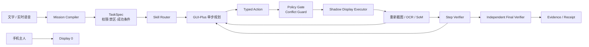

# BearBless：从“自动点手机”到“与用户并行使用同一台手机”

> 本文是项目的设计思路、技术路线、实验记录与答辩复盘。它重点回答：我如何理解问题、为什么这样选型、失败暴露了什么、如何把偶然成功收敛成可验证的系统。

## 1. 我对题目的理解

这道题表面上是手机 GUI Agent，真正的核心却不是“能不能点到按钮”，而是解决三个互相制约的问题：

1. **并行性**：用户继续使用物理主屏，Agent 同时在同一台手机上工作。
2. **不干扰**：Agent 不能抢主屏画面、焦点、键盘或剪贴板，也不能因为失败回退到主屏。
3. **真实性**：Agent 宣布完成时，任务必须真的完成，而不是模型“觉得完成了”。

所以我的判断是：传统的“截主屏—VLM 看图—ADB 点击—再截图”路线即使任务成功，也没有回答这道题。BearBless 的第一性原则应当是：

> **把 Agent 的工作空间与用户的工作空间隔离，再把概率性的智能关进确定性的安全与验证外壳。**

我把系统目标拆成四个工程命题：

- 如何在同一台 Android 上建立 Agent 独占、用户不可见的交互表面；
- 如何保证所有观察与动作始终属于这个表面；
- 如何让模型处理陌生页面，同时不给模型任意设备权限；
- 如何证明任务完成和主屏未被干扰。

## 2. 总体架构



架构不是“一个大模型接 ADB”，而是五个边界清楚的层：

| 层 | 责任 | 不允许做什么 |
|---|---|---|
| Dashboard | 收集意图、展示任务契约、实时状态和证据 | 不直接调用 ADB，不拥有执行生命周期 |
| Mission Compiler | 把自然语言拆成模式、子目标、权限、禁区和完成条件 | 不操作手机 |
| Agent | 基于最新虚拟屏提出一个语义化动作 | 不执行 shell，不自行宣布最终成功 |
| Runtime | 校验、路由并执行 display-scoped 动作 | 不绕过 Guard，不回退到 Display 0 |
| Verifier / Evidence | 用独立信号判断步骤与任务是否完成 | 不只相信模型文本 |

这一分层的关键价值是：**模型可以替换、提示词可以迭代，但隔离、权限和证据规则不随模型变化。**

## 3. 核心技术选型

### 3.1 scrcpy `--new-display`：把虚拟屏当作 Agent 的“平行工作台”

我选择 scrcpy 4.x 创建 Android secondary display，而不是控制主屏。用户继续使用 `Display 0`，Agent 只观察和操作运行时新建的 Shadow Display。

选择它的原因：

- 不需要修改 Android 系统镜像，真实手机可部署；
- 可以得到独立分辨率、独立截图和 display-scoped input；
- 符合题目允许“手机做手脚、大脑在电脑/云端”的边界；
- 比仅用应用后台 API 更能展示复杂 GUI 任务能力。

但虚拟屏不是天然安全。真机实验发现 display ID 每次重建都会变化，旧 ID 甚至可能导致动作落到主屏。因此 Runtime 不缓存并盲用 ID，而是在每个写动作前重新解析 live display，并要求它与当前 Shadow Display 所有权一致；不一致立即停止，绝不使用无 `-d` 的输入作为降级方案。

### 3.2 GUI-Plus + Qwen-VL：规划与验证分离

最终主规划器采用阿里云 GUI-Plus，因为它对手机截图、按钮语义和移动端动作协议的适配优于通用小型 VLM。`qwen3-vl-plus` 用于任务契约补全、协议兜底和独立视觉验证；本地 Qwen3-VL 保留作开发回退。

我没有把模型直接连接到 ADB。模型只能产生封闭的 `PhoneDecision`：点击元素、受限坐标点击、滑动、返回、等待、报告、接管或终止。输出先经过 schema 解析、坐标归一化、Capability Policy 和 Conflict Guard，再转换为运行时动作。

这样做的原因是：

- VLM 最适合处理页面语义与下一步判断；
- 安全边界、重试预算、幂等性和完成判定更适合确定性代码；
- GUI-Plus 欠费、超时或协议漂移时，系统应明确失败，而不是执行猜测动作；
- 更换 AutoGLM、UI-TARS 或其他模型时，不需要重写安全层。

### 3.3 截图 + OCR + Set-of-Mark，而不是全局 UIAutomator

最初直觉是用 UIAutomator 获取结构化节点，但华为 P40 Pro 实验表明：虚拟屏显示 Settings 时，`uiautomator dump` 返回的却是 Display 0 上的美团或 Launcher。这不仅 grounding 错位，还会把用户主屏内容送给 Agent。

因此我禁用了全局 UIAutomator 作为 Shadow Display 的观察源，改为：

1. 对指定 display 截图；
2. 本地 OCR 提取文本与边界框；
3. 生成编号 Set-of-Mark 图；
4. 模型优先输出 `CLICK_ELEMENT(id)`；
5. 可信代码将元素 ID 转换为坐标。

这条路线的代价是 OCR 对异形字体、图标和动态页面不完美，因此保留受限坐标作为非文本控件的后备，但所有动作仍然只能作用于当前虚拟屏。

### 3.4 Accessibility Bridge：解决中文输入，但不假装它能解决 IME 隔离

`adb shell input text` 对中文不可靠，还可能唤起主屏输入法。scrcpy 提供的 `local` / `hide` IME policy 在目标华为 Android 12 上均因“不受信任虚拟屏”被系统拒绝。

我实现了一个极小的 Android Bridge：

- ContentProvider 只接受 shell/root 调用；
- AccessibilityService 使用 `getWindowsOnAllDisplays()`；
- 明确拒绝 Display 0；
- 仅在当前 Shadow Display 上，对唯一或唯一聚焦的可编辑节点执行 `ACTION_SET_TEXT`；
- 联系人点击同样要求 display-scoped、文本精确匹配，并针对 QQ 重复联系人选择“最近聊天”中的后一个候选。

这里有一个重要判断：`ACTION_SET_TEXT` 只是避免主动使用系统键盘，**它不是 IME 隔离的证明**。应用仍可能自己建立输入连接。因此 Runtime 还会监控 Display 0 的 IME 和前台 Activity；一旦观察到可归因泄漏就停止。

### 3.5 Streamlit + 文件队列：展示层与执行层解耦

Dashboard 只负责：输入任务、展示 Mission Contract、确认边界、读取状态与证据。真正执行由独立 Worker 完成。

请求通过本地文件队列流转，并具备：

- 原子 claim，避免两个 Worker 同时执行；
- lease + heartbeat，识别僵尸 Worker；
- stale lease 回收，但不盲目重放不确定的敏感动作；
- 原子写入 state/result/frame，Dashboard 不读取半文件；
- 旧 Worker 可被有序取消和清理，避免“新任务被旧进程接走”。

当前规模下没有引入 Redis。单机、单手机、单 Worker 的演示中，原子文件已经更简单、透明、易调试。只有在多设备、多主机、多 Worker 调度或需要集中式可观测性时，Redis Streams / Celery 才能带来净收益；现在加入只会增加部署面和新的故障点。

## 4. 从通用 Agent 到“通用环 + 专项 Skill”

早期尝试让一个通用 VLM 从头完成所有任务，结果是：它能偶尔成功，却容易在弹窗、加载页、重复联系人、滚轮控件和完成判断上漂移。我的改进不是继续堆提示词，而是建立两层能力：

- **通用 GUI 环**：观察、单步决策、动作门禁、执行、重新观察、循环检测、失败分类；
- **薄专项 Skill**：只描述稳定的领域约束和确定性完成信号。

专项 Skill 不绕过公共 Guard，也不能直接拥有任意 ADB。它们解决的是应用固有语义，而不是把整条任务写成坐标脚本。

### Wolt

- 通过分类和新鲜截图浏览餐厅；
- 遇到 `Continue order?` 等已知状态时继续任务而非误判终止；
- 评分只在列表/卡片阶段读取，地址从店铺详情读取，不要求同一页面同时出现两者；
- 收集店名、类型、评分、地址后，若原始任务还有 QQ 或闹钟子目标，不允许提前 `REPORT` 整个任务完成。

### QQ

- 从用户原句解析精确联系人和精确正文；
- 联系人重名时按用户规则优先“最近聊天”中的候选，而不是点头像顶部或最近转发；
- 中文正文通过 display-scoped Accessibility 写入；
- 发送与草稿是两种不同完成条件；当前实现对明确发送任务采用“发送按钮动作已成功提交”作为事务边界，不再要求最终截图同时完整显示联系人和原气泡，从而避免“实际已发但验证误报失败”；
- 最终发送是敏感动作，只允许一次，禁止失败后自动重放。

### 网易云音乐

- 先解析精确歌曲标题，再使用官方/应用深链进入歌曲页，避免点击搜索框和调用 IME；
- 页面点击只负责启动播放；
- 最终由 Android MediaSession 同时验证歌曲标题与 `PLAYING` 状态；
- 复合任务中“播放成功”只完成音乐子目标，不能吞掉后续 QQ 子目标。

### 系统时钟

- 针对华为滚轮控件使用观察值驱动的单列、单步调整，避免一次大滑动越过目标；
- 支持上午/下午、小时、分钟和每日重复语义；
- 设置前先查已有闹钟：目标已存在且开启即幂等成功，不重复创建；
- 创建后重新读取系统状态验证，而不是只看点击了勾号；
- 若系统状态不确定，停止而不是重放，避免重复任务反而关闭已有闹钟。

## 5. 最困难的问题、失败与修复

### 5.1 “截图成功”不等于“虚拟屏身份正确”

真机重连后曾出现虚拟屏截图与主屏画面别名的情况。如果只检查 display ID 非 0，仍可能把主屏当虚拟屏操作。

修复：每个写动作前同时获取虚拟屏和 Display 0 的解码像素指纹；若二者相同，视为显示身份故障，销毁虚拟屏并停止。再叠加 live-ID、前台包和 IME 监控，形成多信号门禁。

### 5.2 模型把“完成了第一步”误判成“完成了任务”

典型例子是“网易云播放歌曲，并去 QQ 告诉联系人”：模型看到歌曲已播放就终止；又如 Wolt 拿到地址后没有进入 QQ。

根因不是模型不会点，而是任务状态只有一个模糊 goal，没有显式子目标账本。

修复：Mission Compiler 把复合要求拆成有序子目标；`REPORT/FINISH` 必须覆盖尚未完成的 success criteria；每个 Skill 只能完成自己的子目标。Final Verifier 检查整个任务账本，而不是最后一张截图是否“看起来不错”。

### 5.3 实际成功却被判失败

QQ 发送后页面布局、聊天头部和气泡可见区域会变化。要求一张最终截图同时精确出现联系人与原消息，会产生假阴性：动作已经不可逆地完成，Agent 却继续尝试或报告失败。

修复：把“点击发送成功提交”定义为消息事务的 commit point，并记录发送动作、目标联系人、正文摘要和 display identity。发送后立即终止该子目标，禁止再次发送。若未来接入 QQ 官方回执/API，可再增加服务端确认，但不能用视觉不确定性触发重复副作用。

### 5.4 相同任务每次出现不同错误

原因来自多种状态叠加：旧 Worker 抢任务、App 冷启动页不同、上次遗留购物车弹窗、模型 API 欠费、手机 ADB 断连、scrcpy 端口竞争、虚拟屏 ID 变化、页面异步加载和验证条件过强。

修复方式不是无限重试，而是把错误分类：

| 类别 | 策略 |
|---|---|
| 无效果、加载中、可恢复弹窗 | 小预算重新观察/规划 |
| API 欠费、协议错误、设备断开 | 基础设施失败，清晰报错，不消耗 GUI 重试 |
| Display 0 / IME / 身份冲突 | 隔离违规，立即 fail closed |
| 发送、创建闹钟等副作用后不确定 | 不重放，保存证据并停止 |
| 登录、验证码、人机验证 | `TAKE_OVER`，不读取凭据 |

### 5.5 手机一直显示安装 Bridge

Bridge 原本可能在每次任务前重复安装，既慢又干扰设备。改为能力探测优先：已安装、版本匹配、服务可用就复用；仅缺失或版本不匹配时安装。安装属于部署步骤，不属于每个任务的运行步骤。

### 5.6 GUI-Plus 400 / 欠费让前端看起来像“Agent 不工作”

模型调用发生在虚拟屏创建前，因此错误时没有可展示帧；早期 UI 只显示笼统停止，用户难以分辨设备、Worker 还是模型问题。

修复：将 provider availability 作为预检，把 HTTP 400/余额/鉴权等归类为模型基础设施错误，在 Dashboard 显示明确原因；任务未创建虚拟屏时也展示对应空状态，而不是黑框。旧 Worker 在新进程启动前被干净终止，避免错误来源混杂。

## 6. 成功不是一个布尔值：我的验证体系

我把成功分为三层：

1. **动作已接受**：ADB/Bridge/模型协议返回成功；只说明命令被接受。
2. **步骤完成**：新观察符合该动作的 ExpectedOutcome；例如弹窗消失、页面切换、发送按钮提交。
3. **任务完成**：所有 success criteria 均有独立证据，且隔离指标为 0。

证据优先级为：

1. Runtime 确定性状态；
2. Android 系统状态（MediaSession、系统闹钟、包/Activity）；
3. display-scoped Accessibility / 结构化文本；
4. Shadow Display OCR；
5. VLM 视觉解释。

模型不能覆盖更高优先级的冲突证据。Dashboard 中的 Completion Receipt 只展示运行时保存的事实：Shadow Display ID、验证次数、主屏动作数、隔离/IME 违规、replan 次数与最终结果。

## 7. 稳定性、可复用性与扩展性

### 稳定性

- 所有外部输入使用 Pydantic schema；
- 每步重新观察，避免基于过期页面连续点击；
- 对无效果循环和页面加载设置独立预算；
- 对副作用使用幂等检查或单次提交语义；
- Worker 使用 lease、heartbeat、取消和陈旧任务回收；
- 虚拟屏在异常路径也通过 `finally` 清理；
- 故障保留现场，失败原因不会被下一任务覆盖；
- Dashboard 状态、结果和截图采用原子文件替换。

### 可复用性

- `PhoneModelClient` 可替换模型供应商；
- `Planner / Executor / Verifier` 通过接口隔离；
- `composition.py` 是唯一生产装配点；
- 通用 GUI 环覆盖未知 App，专项 Skill 只增加稳定领域约束；
- 所有 App 最终复用同一 Typed Action、Policy、Guard 和证据格式。

### 扩展性

新增应用的顺序是：

1. 先用 `general_gui` 跑探索任务；
2. 记录失败属于 grounding、状态恢复还是完成判定；
3. 只有存在稳定领域不变量时才添加薄 Skill；
4. 增加确定性 verifier 与回归测试；
5. 完成三次真机连续验收后进入演示范围。

如果扩展到多手机/多主机，队列层可以替换为 Redis Streams：请求以 device capability 路由，consumer group 提供租约与恢复，证据写对象存储。Agent 和 Runtime 接口无需改变。但单机版本刻意不提前引入分布式复杂度。

## 8. 测试策略与当前基线

本次提交完整测试结果：

```text
246 passed in 2.75s
```

测试覆盖的不是单纯函数数量，而是主要失败语义：

- TaskSpec、任务模式、消息意图与复合任务拆解；
- GUI-Plus 多种真实响应格式与错误协议；
- Action capability、敏感发送单次性、Display 0 拒绝；
- live display freshness、截图身份隔离、Unicode 输入拒绝回退；
- Worker 原子领取、lease、heartbeat、取消和陈旧任务恢复；
- Wolt、QQ、网易云、闹钟与 YouTube 的路由/完成判定；
- Step Verification、Final Verification、恢复与终态持久化；
- Dashboard 数据读取与失败状态呈现。

自动化测试不能证明特定 ROM 上绝对无干扰。因此演示前还有一个硬件 SOP：

1. `bearbless doctor`，保存设备、scrcpy 与 display capability 报告；
2. 清理旧 Worker，确认只存在一个 lease owner；
3. 让用户持续在 Display 0 打字/切换 App；
4. 同一主链路连续运行三次；
5. 每次确认 `primary_display_actions=0`、包泄漏=0、IME 违规=0、隔离违规=0；
6. 任何一次失败都从第 1 次重新计数；
7. 镜头同时拍到实体手机主屏、Dashboard 虚拟屏与完成回执。

## 9. 我如何使用 AI 辅助编码

我把 Coding Agent 当作并行工程搭档，而不是代码生成按钮：

- 先让 AI 帮助枚举架构假设与潜在失败模式；
- 每次只改一个可验证问题，例如“不要提前结束复合任务”或“发送后禁止重放”；
- 用真实截图、运行 trace 和用户现场观察纠正模型的错误判断；
- 要求改动先通过单测，再跑真机，不以“代码看起来合理”作为完成；
- 对 AI 生成的安全逻辑重点审查：是否存在 Display 0 fallback、是否把模型文本当证据、是否会重复不可逆动作、异常路径是否清理资源；
- 每次失败都沉淀为测试、Decision Record 或显式限制，而不是只追加提示词。

这个过程也暴露了 AI Coding 的一个典型风险：一次“大优化”可能破坏之前偶然跑通的链路。后来我的节奏变成“冻结成功基线 → 小步修改 → 单功能回归 → 完整链路回归”，优化必须建立在成功之后。

## 10. 没有回避的限制

- Android secondary display 行为高度依赖 ROM 与目标 App；一个 App 已安装不代表它能安全运行在虚拟屏。
- 目标华为设备拒绝为不受信任虚拟屏设置 local/hide IME policy，因此中文交互必须走经验证的无 IME 路径；没有安全路径就停止。
- OCR/VLM 会受字体、动画、弹窗和网络加载影响，专项 Skill 仍需要真实 App 更新后的维护。
- GUI-Plus 是外部依赖，存在额度、网络、延迟与协议变化风险；本地 fallback 的手机理解能力较弱。
- QQ 最终发送属于不可逆外部副作用。当前用明确用户原文、精确联系人、单次 commit 和禁止重放降低风险，但这不是官方 API 级别的送达回执。
- “零干扰”是运行时观测和真机演示支持的工程结论，不是对所有 Android 设备的形式化证明。
- 当前是单机单设备演示架构；没有用 Redis、Kubernetes 或复杂多 Agent 编排来制造规模感。

## 11. 我会如何进行 1–2 分钟演示

主镜头同时覆盖实体手机和 Dashboard：

1. 用户在主屏持续聊天或输入文字；
2. 在 Dashboard 输入一个复合任务并查看 Mission Contract；
3. 确认后离开 Dashboard，Worker 在 Shadow Display 执行；
4. Dashboard 实时展示 Agent 的子目标、虚拟屏、当前动作与验证；
5. 用户主屏全过程不跳、不抢焦点、不弹 Agent 输入法；
6. 任务完成后立即停止，展示 Completion Receipt 与 0 次主屏操作；
7. 如果遇到登录/验证码或隔离异常，演示 fail-closed，而不是硬点下去。

## 12. 如果继续迭代

优先级不是再堆更多 App，而是提升可量化的可靠性：

1. 建立每条演示链路的 20 次真机回归矩阵，统计成功率、P50/P95 时延和失败分类；
2. 为应用页面状态建立轻量视觉状态机，减少每一步都调用大模型；
3. 将服务端可验证能力优先于视觉验证，例如官方消息回执或系统 API；
4. 自动生成失败最小复现包：任务契约、模型响应、动作、前后帧、系统状态；
5. 在第二款 Android ROM 上重新跑 capability probe，区分设备策略与通用能力；
6. 只有出现多设备并发需求后，再将文件队列迁移到 Redis Streams。

## 结论

BearBless 最重要的成果不是“让模型点了几个 App”，而是形成了一套可以解释、可以失败、可以验证的手机 Agent 方法：

> **用 Shadow Display 建立并行空间，用 Typed Action 和 Guard 约束智能，用专项 Skill 收敛应用不变量，用独立验证定义完成，用证据链证明没有打扰用户。**

这套系统仍有设备与应用兼容边界，但这些边界被明确记录、可重复测试，并在不确定时选择停止。这比一次偶然跑通更接近一个可信的手机 Agent。
