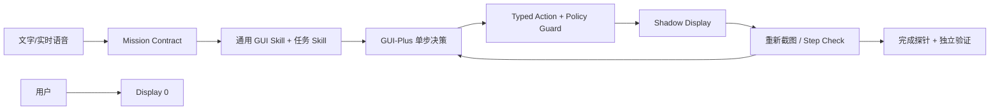

# 与熊同行 · BearBless

**One phone. Two users. Zero intentional interruption.**

BearBless 是一个 Android 手机 Agent 原型：用户继续使用物理屏 `Display 0`，Agent 在同一台手机的 scrcpy 虚拟屏中观察、规划、操作和验证。模型只能提出有限动作；运行时重新解析虚拟屏 ID，并以 Guard 阻止 Display 0、剪贴板、凭据和越权操作。



## 关键选择

- **隔离优先：** `scrcpy --new-display` 创建独立工作区；每次输入前重新解析 live display ID，不允许回退到 Display 0。
- **不依赖全局 UIAutomator：** 已在华为 P40 Pro 验证其返回 Display 0，而非虚拟屏；Agent 使用虚拟屏截图、OCR/Set-of-Mark 和 GUI 模型。
- **两层 Skill：** 通用层负责截图、点击、滑动、文字桥、返回、验证和恢复；音乐、闹钟、消息等专项 Skill 只补充语义约束及确定性完成条件。
- **键盘隔离：** 华为 Android 12 拒绝修改不受信任虚拟屏的 IME policy，因此中文输入通过可选 Accessibility Bridge 的 `ACTION_SET_TEXT` 完成；桥不可用时拒绝可能唤起主屏输入法的非 ASCII 输入。
- **失败闭合：** 登录、验证码和人机验证转人工；隔离失败立即停止；模型格式错误与页面导航失败使用独立预算。

当前目标是一个可信演示原型，不宣称生产级通用性。已保存的真实成功证据包括：隔离 DSB 页面验证、蓝牙状态查询和网易云播放；闹钟、美团复杂搜索和消息发送仍属于回归改进项。完整设计、实验与失败记录见 [ARCHITECTURE.md](ARCHITECTURE.md)、[DECISIONS.md](DECISIONS.md) 和 [DELIVERY_AUDIT.md](DELIVERY_AUDIT.md)。

当前产品回归范围冻结为五类：QQ、​美团、地图、音乐和时钟。新 App 仍可尝试通用 GUI 能力，但不作为本次交付承诺。

## 部署

要求：Android 11+、USB 调试、ADB、scrcpy 4.x、Python 3.11+。

```bash
python -m venv .venv
source .venv/bin/activate
pip install -r requirements.txt
cp .env.example .env

python -m bearbless doctor
python -m pytest -q
streamlit run dashboard/app.py
```

若任务需要中文输入，构建并安装 `android-bridge/`，在手机辅助功能中启用 **BearBless 虚拟屏输入桥**，然后验证：

```bash
adb shell content call \
  --uri content://com.bearbless.bridge.control \
  --method health
```

Dashboard：`http://127.0.0.1:8501`。提交任务、确认边界后即可离开 Dashboard，执行由独立 worker 完成。

## 环境变量

```env
ANDROID_SERIAL=
SCRCPY_PATH=scrcpy
ADB_PATH=adb
SHADOW_WIDTH=1080
SHADOW_HEIGHT=2400
SHADOW_DPI=420
ACCESSIBILITY_BRIDGE_AUTHORITY=com.bearbless.bridge.control

PHONE_MODEL_PROVIDER=gui_plus
PHONE_MODEL_BASE_URL=https://dashscope.aliyuncs.com/compatible-mode/v1
PHONE_MODEL_NAME=gui-plus-2026-02-26
PHONE_VERIFIER_MODEL_NAME=qwen3-vl-plus
PHONE_MODEL_API_KEY=replace_me
```

API Key 只放 `.env`，该文件已被 `.gitignore` 排除。模型替换不会绕过 Action Schema、Policy、Conflict Guard 或最终验证。
