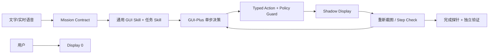

# 与熊同行 · BearBless

**One phone. Two users. Zero intentional interruption.**

BearBless 是一个 Android 手机 Agent 原型：用户继续使用物理屏 `Display 0`，Agent 在同一台手机的 scrcpy 虚拟屏中观察、规划、操作和验证。模型只能提出有限动作；运行时重新解析虚拟屏 ID，并以 Guard 阻止 Display 0、剪贴板、凭据和越权操作。



## 关键选择

- **隔离优先：** `scrcpy --new-display` 创建独立工作区；每次输入前重新解析 live display ID，不允许回退到 Display 0。
- **不依赖全局 UIAutomator：** 已在华为 P40 Pro 验证其返回 Display 0，而非虚拟屏；Agent 使用虚拟屏截图、OCR/Set-of-Mark 和 GUI 模型。
- **两层 Skill：** 通用层负责截图、点击、滑动、文字桥、返回、验证和恢复；音乐、闹钟、消息等专项 Skill 只补充语义约束及确定性完成条件。
- **双屏身份门禁：** 每次写操作前同时读取虚拟屏与 Display 0 的解码像素指纹；若厂商系统在重连后把虚拟屏截图别名到主屏，先拦截动作并销毁虚拟屏。主屏 Activity、焦点或 IME 泄漏同样立即失败。
- **键盘隔离：** 已专项验证 scrcpy 的 `local` 与 `hide` IME policy；华为 Android 12 均以“不受信任虚拟屏”拒绝。主路径因此使用深链、URL query、页面已有元素和可选 Accessibility Bridge `ACTION_SET_TEXT`，并以 Display 0 键盘监控熔断。`ACTION_SET_TEXT` 只避免为输入而主动点击，不被当作 IME 隔离机制。
- **失败闭合：** 登录、验证码和人机验证转人工；隔离失败立即停止；模型格式错误与页面导航失败使用独立预算。

当前目标是一个可信演示原型，不宣称生产级通用性。完整的思考过程、技术选型、困难与解决方案见 [设计与复盘](docs/DESIGN_JOURNEY.md)；架构、决策和交付边界分别见 [架构说明](docs/ARCHITECTURE.md)、[决策记录](docs/DECISIONS.md) 和 [交付审计](docs/DELIVERY_AUDIT.md)。全部文档入口见 [`docs/`](docs/README.md)。

当前产品回归范围冻结为四类：QQ、Wolt、音乐和时钟。餐厅地址直接从 Wolt 店铺详情页读取，不依赖地图；地图能力不作为本次交付承诺。新 App 仍可尝试通用 GUI 能力，但不计入稳定演示范围。

## 部署

要求：Android 11+、USB 调试、ADB、scrcpy 4.x、Python 3.11+。

```bash
python -m venv .venv
source .venv/bin/activate
pip install -e '.[dev,dashboard]'
# 若需要浏览器实时中文听写：pip install -e '.[voice]'
cp .env.example .env

python -m bearbless doctor
python -m pytest -q
python -m bearbless worker
# 另开一个终端
streamlit run dashboard/app.py
```

若任务需要中文输入，构建并安装 `android-bridge/`，在手机辅助功能中启用 **BearBless 虚拟屏输入桥**，然后验证：

```bash
adb shell content call \
  --uri content://com.bearbless.bridge.control \
  --method health
```

Dashboard：`http://127.0.0.1:8501`。提交任务、确认边界后即可离开 Dashboard，执行由独立 Worker 进程完成。请求使用跨进程原子领取、lease 心跳与过期回收；Dashboard 重载不会中断正在执行的任务。

## 环境变量

```env
ANDROID_SERIAL=
SCRCPY_PATH=scrcpy
ADB_PATH=adb
SHADOW_WIDTH=1080
SHADOW_HEIGHT=2400
SHADOW_DPI=420
ACCESSIBILITY_BRIDGE_AUTHORITY=com.bearbless.bridge.control

PHONE_MODEL_PROVIDER=gui_plus
PHONE_MODEL_BASE_URL=https://dashscope.aliyuncs.com/compatible-mode/v1
PHONE_MODEL_NAME=gui-plus-2026-02-26
PHONE_VERIFIER_MODEL_NAME=qwen3-vl-plus
PHONE_MODEL_API_KEY=replace_me
```

API Key 只放 `.env`，该文件已被 `.gitignore` 排除。模型替换不会绕过 Action Schema、Policy、Conflict Guard 或最终验证。
